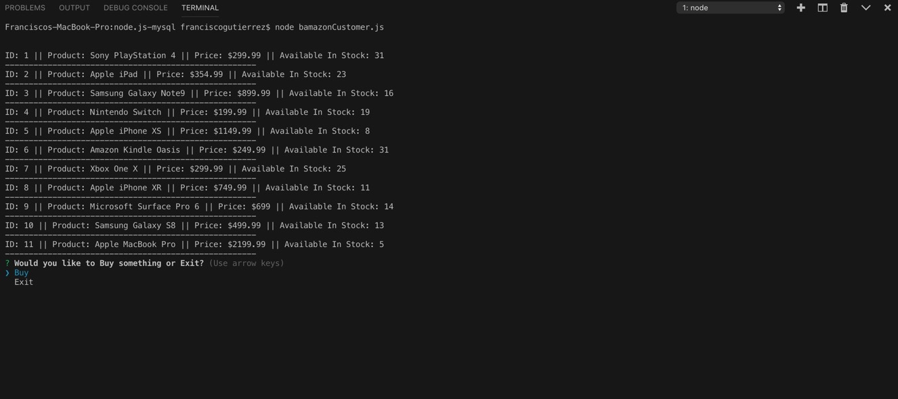
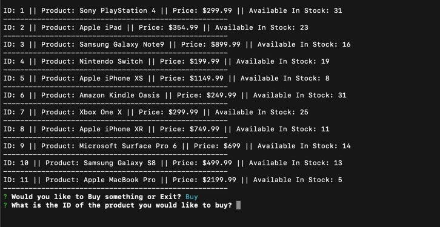
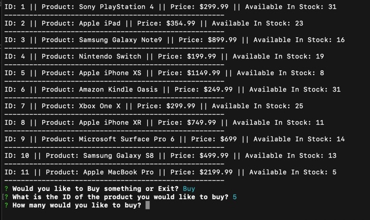
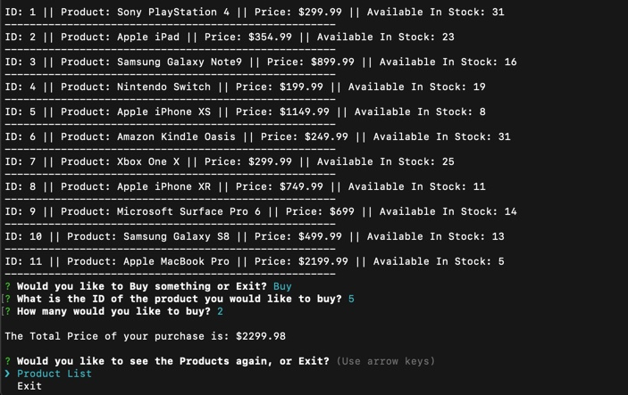
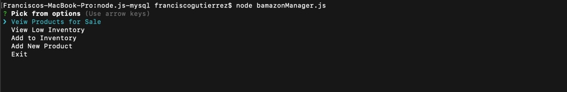
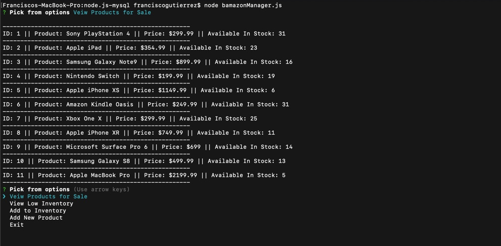
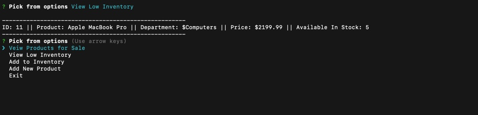
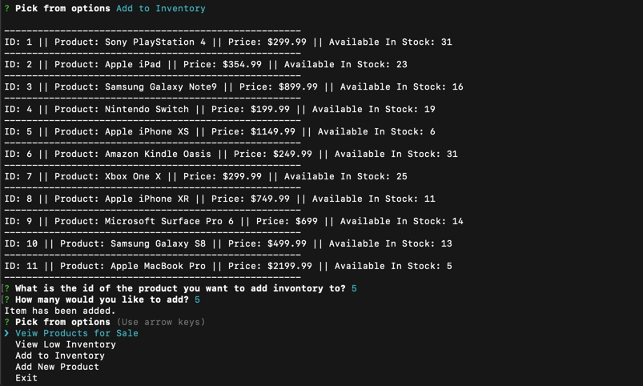
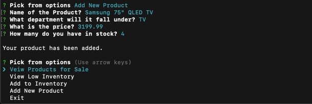

# node.js-mysql

The Database - 
    You will have to set up your own database. I have put in a products.csv and a schema.sql in for you so that it will be quick and easy.

NPM - 
    For this app you will also need to do a npm install for mysql and inquirer.

I hope you enjoy this little project!

Bamazon Customer -
This project is taking mySQL and using node to read, update, add to, and display the database. It is an app for a store that displays items to the consumer and alows them to select items and buy them. When this is done the stock quantity for that item is updated. 

once the app is started the user has the display of all the items for sale, along with there price per item and the available in stock. The message asking if they would like to buy something or exit is also display with Buy and Exit as the choices.

Selecting Buy will promt the user to put in the id of the product they would like to buy.

Then the user is asked how many they would like?

If nothing went wrong and there are enough available of said product the amount of the purchase is displayed with the product list again and asking if they would like to see the product list or Exit. Choosing the Product list option from here will start the whole process over. Exiting will end the app.

Bamazon Manager -

This little app is for the Manager. He can take a look at all the items in stock, add stock to specific items, add new products, and be able to view products with low invontory(under 5 in stock).

When this program is started up the first thing the manager sees is a list of 5 options to pick from.

The first option is View Products for Sale. When selected it displays all the products with id, name , price and the amount in stock. At the bottom is the same list as the first one on the screen with the manager being able to do what they want next.

The next option is Veiw Inventory and selection that option displays all products with available in stock of less than 5. The original options for what to due next also display

Add to inventory is just what it says. It allows the manager to select a product and at more available in stock to that product. When selected it will display the product list and ask for the id of the product they want to ask for. Then they are asked for how many to add. Then if all went well it displays the message Item has been added, and the options list appears to do the next task.

Add a New Product allows the manager to and a new product to there invontory. They are promted to input the Name of the product, What department will it be in, What will the price be, and how many to put in the initial stock. once that is all complete and all went well a message saying Your product has been added is displayed and the options list is displayed for next thing to do.

The last option is Exit and this leaves the app.

