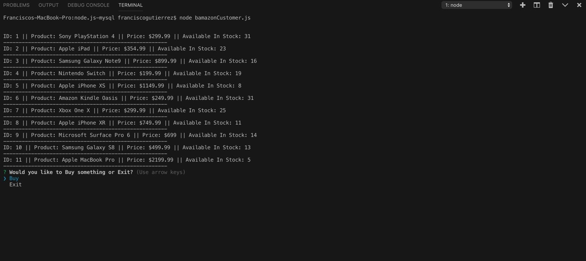

# node.js-mysql

Bamazon Customer -
This project is taking mySQL and using node to read, update, add to, and display the database. It is an app for a store that displays items to the consumer and alows them to select items and buy them. When this is done the stock quantity for that item is updated. 

once the app is started the user has the display of all the items for sale, along with there price per item and the available in stock. The message asking if they would like to buy something or exit is also display with Buy and Exit as the choices.

